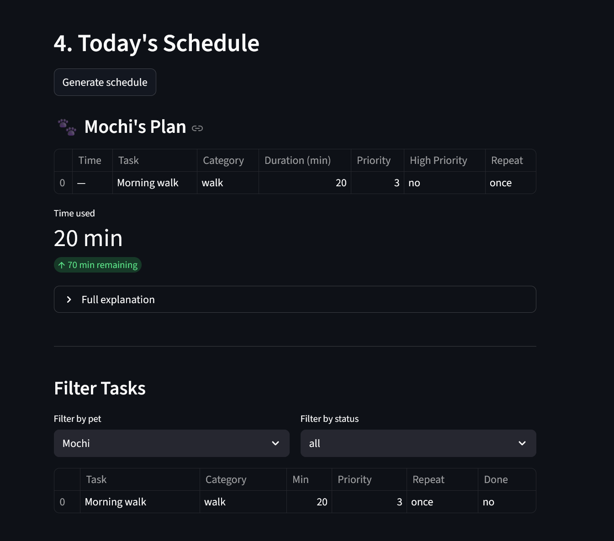
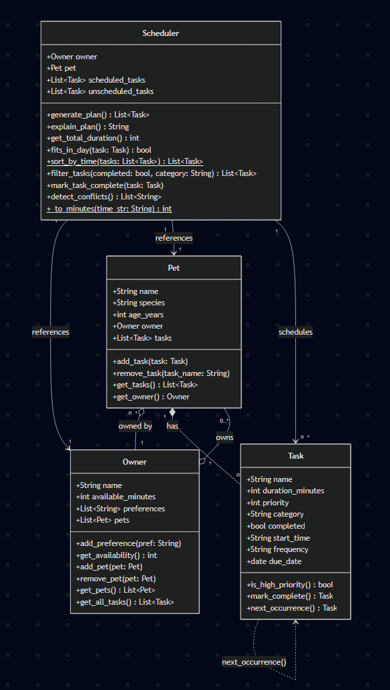

# 🐾 PawPal+

**PawPal+** is a Streamlit app that helps a busy pet owner plan daily care tasks across multiple pets.
It schedules activities by priority and available time, detects conflicts, handles recurring tasks,
and presents the plan in a clear, interactive UI.

---

## 📸 Demo

> **To add your screenshot:** run `streamlit run app.py`, take a screenshot of the browser window,
> save it as `screenshot.png` in the project root, and this image will render below.



---

## ✨ Features

### Scheduling
- **Priority-first greedy planner** — tasks are sorted highest-priority first (1–5 scale) and packed
  into the owner's available time budget for the day. Tasks that don't fit are flagged separately.
- **Time budget tracking** — the UI shows exactly how many minutes were used and how many remain,
  using a live metric widget.

### Sorting
- **Chronological sort** (`Scheduler.sort_by_time`) — all task lists are displayed in clock order
  using `HH:MM` start times. Tasks without a start time float to the bottom rather than being excluded.

### Filtering
- **Status and category filter** (`Scheduler.filter_tasks`) — the schedule view includes a filter
  panel to narrow tasks by pet, completion status (all / incomplete / complete), or category
  (walk, feed, meds, grooming, enrichment).

### Recurring Tasks
- **Daily and weekly recurrence** — tasks marked with `frequency="daily"` or `frequency="weekly"`
  automatically generate a next occurrence (via `Task.next_occurrence`) when completed.
  The new task is added directly to the pet's task list with the correct due date using `timedelta`.

### Conflict Detection
- **Overlap detection** (`Scheduler.detect_conflicts`) — after a plan is generated, the scheduler
  checks every pair of timed tasks for overlapping windows using the standard interval test
  (`A_start < B_end AND B_start < A_end`). Conflicts are surfaced as prominent red banners in the UI
  so the owner can fix them before acting on the plan.

---

## 🗂 System Design

### Class Diagram (UML)



| Class | Responsibility |
|---|---|
| `Task` | Represents one care activity — stores duration, priority, start time, frequency, and due date |
| `Pet` | Holds a pet's profile and its list of tasks; maintains a back-reference to its owner |
| `Owner` | Manages one or more pets and exposes the daily time budget and preferences |
| `Scheduler` | The planning brain — generates a priority-ordered schedule, sorts, filters, detects conflicts, and handles recurring task completion |

---

## 🚀 Getting Started

### Prerequisites

- Python 3.10+
- pip

### Setup

```bash
python -m venv .venv
source .venv/bin/activate   # Windows: .venv\Scripts\activate
pip install -r requirements.txt
```

### Run the app

```bash
streamlit run app.py
```

### Run the terminal demo

```bash
python main.py
```

---

## 🧪 Testing PawPal+

Run the full test suite from the project root:

```bash
python -m pytest
```

### What the tests cover

| Area | Tests |
|---|---|
| **Task completion** | `mark_complete()` flips `completed` to `True` |
| **Pet task list** | `add_task()` correctly grows the task count |
| **Sorting** | `sort_by_time()` returns tasks in chronological order; tasks without a time go last; empty list is safe |
| **Recurrence** | Daily tasks produce a next occurrence due tomorrow; weekly tasks due in 7 days; one-off tasks return `None`; next occurrence inherits all attributes; `mark_task_complete()` auto-appends the follow-up to the pet |
| **Conflict detection** | Overlapping windows produce a warning; adjacent (non-overlapping) tasks do not; tasks without `start_time` are excluded from conflict checks |
| **Edge cases** | Pet with no tasks returns an empty plan; a task longer than available time is skipped; `filter_tasks` filters correctly by completion status and category |

**Confidence level: ★★★★☆**
The core scheduling, sorting, recurrence, and conflict-detection paths are all covered by 17 automated tests.
The main untested gap is the Streamlit session-state layer (UI interactions) and multi-pet conflict scenarios.

---

## 📁 Project Structure

```
pawpal-starter/
├── app.py              # Streamlit UI
├── pawpal_system.py    # Core classes: Task, Pet, Owner, Scheduler
├── main.py             # Terminal demo / testing ground
├── uml_diagram.png     # Class diagram
├── tests/
│   └── test_pawpal.py  # Automated test suite (pytest)
├── reflection.md       # Design decisions and tradeoffs
└── requirements.txt
```
